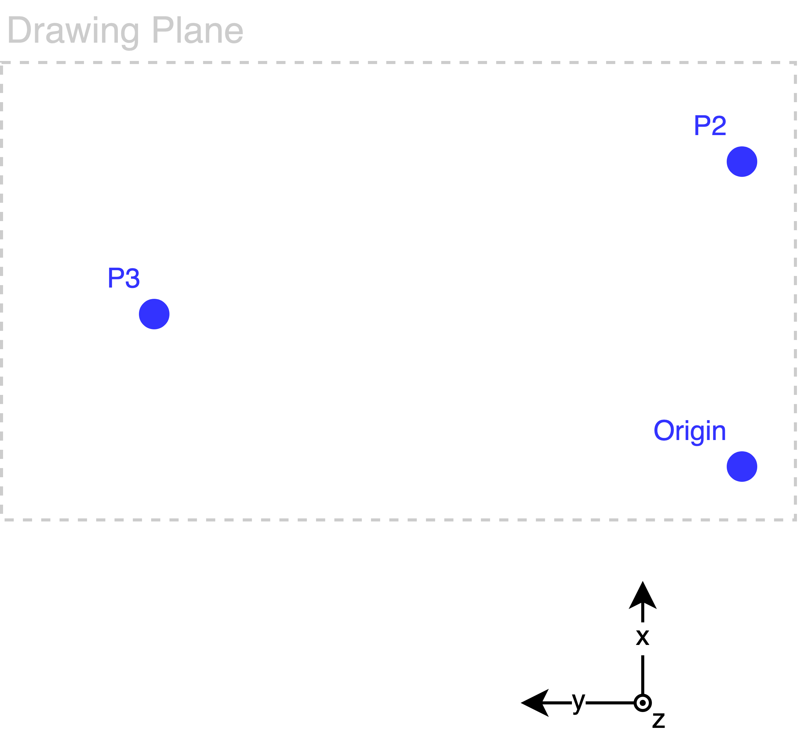

# Drawing robot

## Execution guideline:
* Running the python script:
```
<python command> main.py <path to image> <scaling factor>
```
	* `<scaling factor>`: 1 means image drawing with original dimensions, bear in mind that a direct conversion between is made of 1px=1mm.
* The message `Calibrate Drawing Plane:` will show on the console followed by `Move to Origin and press [Enter]`. Move the robot to the origin of the skecth, make sure the pen is touching the drawing plane (ex: paper) and press [Enter]. Do the same for the other 2 points when prompted to, moving the pen to any position in the drawing plane. An example is given below:


